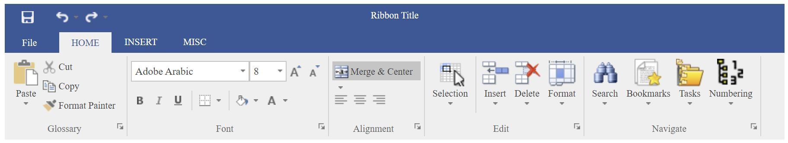

React Ribbon Component



<MainRibbon />

With Sub Components

<RibbonTabPage />
<RibbonGroup />
<RibbonColumn />
<RibbonRow />
<Separator />
<DropDownWithLargeImageWithText />
<ComboBox />
<ButtonWithLargeImageWithText />
<SplitButton />
<PopupMenu />
<MenuItem />
<MenuDropDown />
<MenuSeparator />
<ButtonWithSmallImage />
<DropDownWithSmallImage />
<SplitButtonWithSmallImage />
<ButtonWithSmallImageWithText />
<DropDownWithSmallImageWithText />
<Checkbox />

MainRibbon properties
- text (title)
- property "palette" for theming, example: 
{
    {
        main: '#2a569a',
        tabBody: '#efefef',
        inActiveTab: 'white',
        backStageButton: 'yellow',
        activeBackStageButton: 'blue',
        backStageText: 'brown',
    }
}
- currentTab - int
- font - string (ex `normal 11px 'Open Sans'`)
- quickAccessButtons - object ex
```
[
  <ButtonWithSmallImage
       image={save} key="quickaccess1" />,
  <DropDownWithSmallImage
       image={undo} key="quickaccess2" />,
  <DropDownWithSmallImage
       image={redo} key="quickaccess3" />
]
```
- tabEvents - (onClick to get new tab index)
- fileButtonEvents
* children of type RibbonTabPage

RibbonTabPage properties
- text (title)
* children of type RibbonGroup, Separator

RibbonGroup properties
- text (title)
* children of type SplitButton, RibbonColumn, RibbonRow, DropDownWithLargeImageWithText, Separator

Group controls: (todo)
- check styleguide example for example